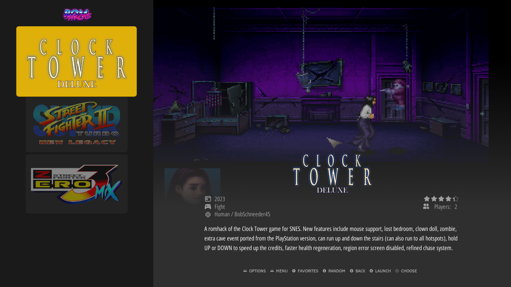

# Obsidian

Obsidian is an EmulationStation theme for RetroPie.

```
based on art-book by anthonycaccese - https://github.com/anthonycaccese/es-theme-art-book
based on carbon v2.5 - 2020-11-17 by Tomaz
based on carbon v2.4 by Rookervik
based on simple(c) Nils Bonenberger - nilsbyte@nilsbyte.de - http://blog.nilsbyte.de/
For use with EmulationStation (http://www.emulationstation.org/)
```
See [Carbon's CHANGELOG](./CARBON_CHANGELOG.txt) for details regarding the Carbon Theme.


## Table of Contents

- [Features](#features)
- [Installation](#installation)
- [Launch Images](#launch-images)
- [Custom Collections](#custom-collections)
- [Splashscreens](#splashscreens)
- [Attributions](#attributions)


## Features

The theme supports RetroPie/EmulationStation's 4 gamelist view style in a 16:9 aspect ratio.

- Basic
- Detailed
- Video
- Grid


### System View

**Default Platform**

Uses colorful platform logos from carbon theme.


**Custom Collection**

Supports various game collections and series.


**Custom System**

Adds custom systems logos (e.g. romhacks, openbor, homebrews, etc)

|     |     |
| --- | --- |
|  |  |


### Basic View


|     |     |
| --- | --- |
|  |  |


### Detailed / Video View


> :pencil: **Video View** is same as Detailed View, but a video will play in the background after a delay (requires scraping video enabled).

### Grid View


|     |     |
| --- | --- |
|  |  |

### RetroPie Settings Screens

| System View | Basic View |
| ----------- | ---------- |
|        |         |
| **Detailed / Video View**  | **Grid View** |
|        |         |


## Installation

**Using Git**:

```bash
cd ~/.emulationstation/themes
git clone --depth=1 git@github.com:lioneil/obsidian-es-theme.git obsidian
```

**Manual installation**:

- Download the [latest](#todo-download-link) zip file (master branch will always be the latest stable release).
- Extract the contents to `/home/<user>/.emulationstation/themes/obsidian/` directory.

See other [releases](#todo-releases-link).


## Launch Images

> This feature is optional. See the section about installing Launch Images if you want this feature.

The theme can add custom launch images per system in place of the default runcommand screen. The runcommand screen is RetroPie's script responsible to launch your emulators/games. This screen shows the runcommand's configurations and features.

Here is the default runcommand screen:


Here is the theme's replacement launch image for NeoGeo:


### Installing Launch Images

Run the script `install-launch-images.sh` included in this theme.

```bash
cd ~/.emulationstation/themes/obsidian # or wherever you installed the theme.
chmod a+x .bin/install-launch-images.sh # to allow it to execute under your user
.bin/install-launch-images.sh # run it
```

The script will simply copy files from `./assets/launchers/` to `/opt/retropie/configs/`. Check the script included in this theme for the code.

Make sure "Launch menu art" is Disabled. In EmulationStation, go to RetroPie Setup > configuration / tools > runcommand. Set "Launch meu art" to Disabled. Otherwise the game's scraped box art will show up on the runcommand screen. More details about Launch Menu can be found in the [RetroPie docs](https://retropie.org.uk/docs/Runcommand/#adding-custom-launching-images).

There is also an uninstall script which simply removes all `/opt/retropie/configs/*/launching.png` files.

```bash
cd ~/.emulationstation/themes/obsidian # or wherever you installed the theme.
chmod a+x .bin/uninstall-launch-images.sh
.bin/uninstall-launch-images.sh
```

And of course, you can always just manually copy the files from `./assets/launching/` and paste them in `/opt/retropie/configs/`.

## Custom Collections

The theme supports various game collections (e.g. streetfighter, megamanx, etc).


In EmulationStation, go to Menu > Game Collection Settings > Create New Custom Collection from Theme, pick the collection you want and start adding games. There is a way to automate this process, detailed below.

**Automatic Custom Collection from Theme**

The theme comes with a (low-tech) script to automate the collections of games.

```bash
cd ~/.emulationstation/themes/obsidian # or wherever you installed the theme.
chmod a+x .bin/generate-custom-collections.sh
.bin/generate-custom-collections.sh

# or add -f flag to DELETE ALL ~/.emulationstation/collections/custom-[supported].cfg files first
# then force regenerate them. Only supported custom collections are deleted,
# your own custom-*.cfg will not be touched.
.bin/generate-custom-collections.sh -f
```

This will generate `custom-<collection-name>.cfg` in `~/.emulationstation/collections` directory.

Then in EmulationStation, go to Main Menu (press start) > Game Collection Settings > Custom Game Collections, and check all desired collections.

Please see [list](./SUPPORTED_CUSTOM_COLLECTIONS.txt) of currently supported game collections. The list might expand.

**How it works**

The script will attempt to read your `roms` directory, and try to regex-match the file names found againts a preset of known file names for a given custom-collection. It's pretty low-tech in a sense that the association between a custom-collection and what games goes in that collection is hardcoded in the script. Check out the [script](./.bin/generate-custom-collections.sh) to see the list of files and it's associated custom-collection.


## Splashscreens

The theme comes with its custom [RetroPie Splashscreens](https://retropie.org.uk/docs/Splashscreen/). Please note, splashscreens are only available on the Raspberry Pi.


**Installation**

```bash
cd ~/.emulationstation/themes/obsidian # or wherever you installed the theme.
chmod a+x .bin/install-splashscreens.sh # to allow it to execute under your user
.bin/install-splashscreens.sh # run it
```

This will copy files from `assets/splashscreens/` to `~/RetroPie/splashscreens`.

Then in EmulationStation settings, choose your desired splashscreen as described in the [docs](https://retropie.org.uk/docs/Splashscreen).


---


### Attributions

- System logos directly copied from [carbon theme](https://github.com/RetroPie/es-theme-carbon-2021)
- Additional system, platform, and console logos from [Dan Patrick](https://archive.org/details/console-logos-professionally-redrawn-plus-official-versions)
- [Bootleg Games](./bootlegs/marquee.png) logo created by me.
- "ROM" text in [ROMHacks](./romhacks/marquee.png) logo generated from <a href="https://www.textstudio.com/">Text Studio</a>
- "Hacks" text in [ROMHacks](./romhacks/marquee.png) logo used Lazer '84 Font - a free font inspired in 80's. Designed by [Juan Hodgson](https://www.behance.net/gallery/31261857/LAZER-84-Free-Font).
