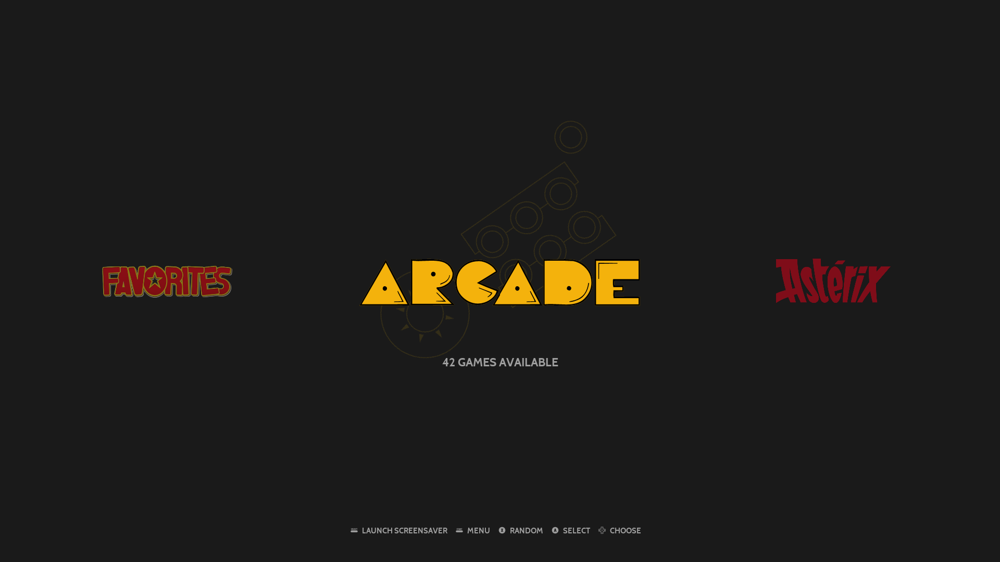
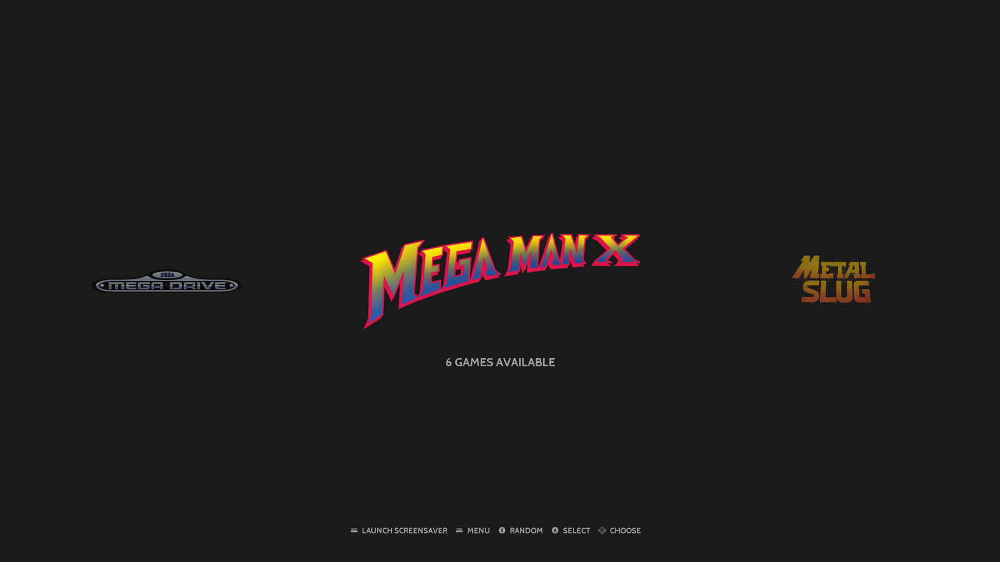
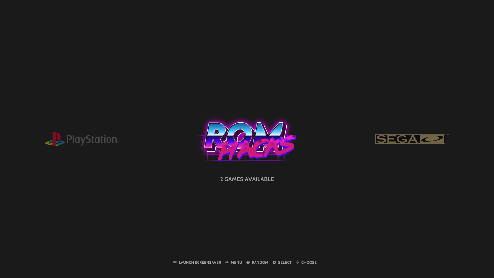
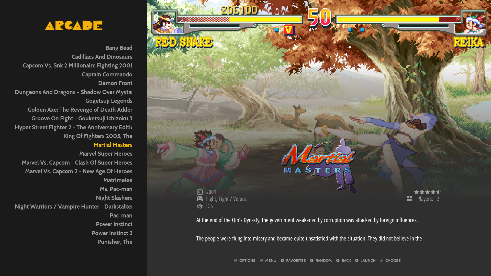
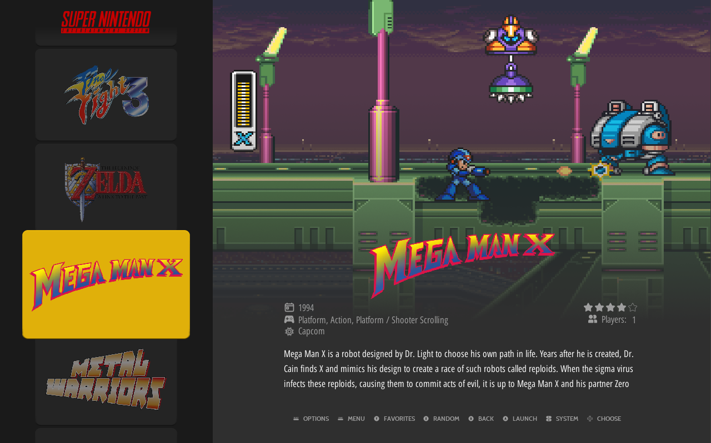
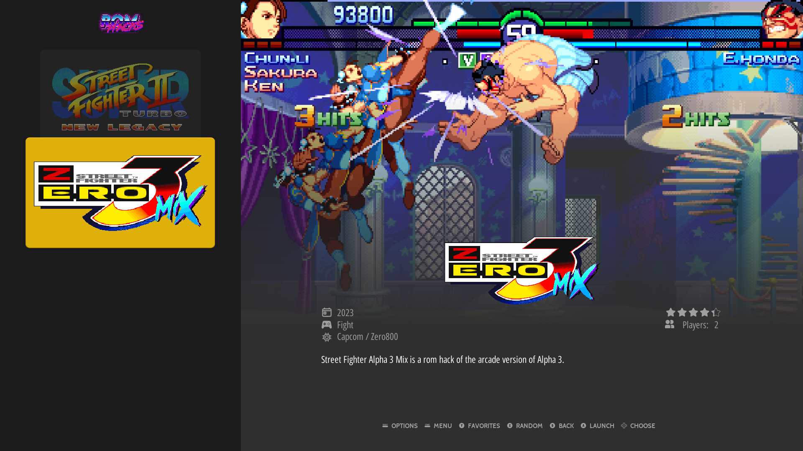

# Obsidian

Obsidian is an EmulationStation theme for RetroPie.

```
based on art-book by anthonycaccese - https://github.com/anthonycaccese/es-theme-art-book
based on carbon v2.5 - 2020-11-17 by Tomaz
based on carbon v2.4 by Rookervik
based on simple(c) Nils Bonenberger - nilsbyte@nilsbyte.de - http://blog.nilsbyte.de/
For use with EmulationStation (http://www.emulationstation.org/)
```
See [Carbon's CHANGELOG](./CARBON_CHANGELOG.txt) for details regarding the Carbon Theme.

## Features

The theme supports RetroPie/EmulationStation's 4 gamelist view style in a 16:9 aspect ratio.

- Basic
- Detailed
- Video
- Grid


### System View

**Default Platform**

Uses colorful platform logos.



**Custom Collection**

Supports various game collection and franchises.



**Custom System**

Adds custom systems logos (e.g. romhacks, openbor)




### Basic View

todo...

### Detailed View



### Video View

todo...

### Grid View





---

## Attributions

- System logos directly copied from [carbon theme](https://github.com/RetroPie/es-theme-carbon-2021)
- Additional system, platform, and console logos from [Dan Patrick](https://archive.org/details/console-logos-professionally-redrawn-plus-official-versions)  
- [Bootleg Games](./bootlegs/marquee.png) logo created by me.
- "ROM" text in [ROMHacks](./romhacks/marquee.png) logo generated from <a href="https://www.textstudio.com/">Text Studio</a>
- "Hacks" text in [ROMHacks](./romhacks/marquee.png) logo used Lazer '84 Font - a free font inspired in 80's. Designed by [Juan Hodgson](https://www.behance.net/gallery/31261857/LAZER-84-Free-Font).
