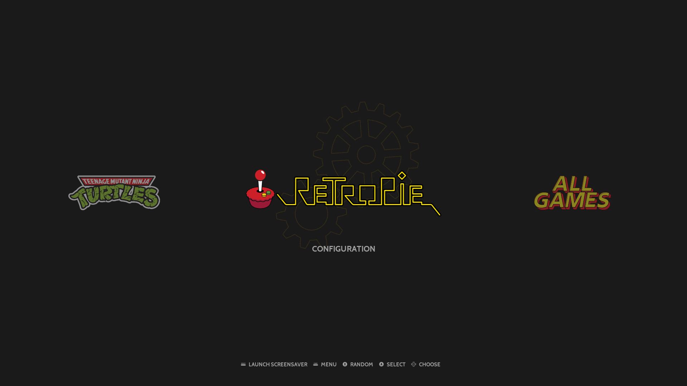

# Obsidian

Obsidian is an EmulationStation theme for RetroPie.

```
based on art-book by anthonycaccese - https://github.com/anthonycaccese/es-theme-art-book
based on carbon v2.5 - 2020-11-17 by Tomaz
based on carbon v2.4 by Rookervik
based on simple(c) Nils Bonenberger - nilsbyte@nilsbyte.de - http://blog.nilsbyte.de/
For use with EmulationStation (http://www.emulationstation.org/)
```
See [Carbon's CHANGELOG](./CARBON_CHANGELOG.txt) for details regarding the Carbon Theme.


## Table of Contents

- [Features](#features)
- [Installation](#installation)
- [Launch Images](#launch-images)
- [Custom Collections](#custom-collections)
- [Splashscreens](#splashscreens)
- [Pause Overlays](#pause-overlays)
- [Attributions](#attributions)


## Features

The theme supports RetroPie/EmulationStation's 4 gamelist view style in a 16:9 aspect ratio.

- Basic
- Detailed
- Video
- Grid


### System View

**Default Platform**

Uses colorful platform logos from carbon theme.


**Custom Collection**

Supports various game collections and series.


**Custom System**

Adds custom systems logos (e.g. romhacks, openbor, homebrews, etc)

<table style="width: 100%">
  <tbody>
    <tr>
      <td>  </td>
      <td>  </td>
    </tr>
  </tbody>
</table>


### Basic View

<table style="width: 100%">
  <tbody>
    <tr>
      <td colspan="2">  </td>
    </tr>
    <tr>
      <td>  </td>
      <td>  </td>
    </tr>
  </tbody>
</table>


### Detailed / Video View

> [!NOTE]
> **Video View** is same layout as Detailed View, but a video will play in the background after a delay (requires scraping video enabled). \
> Disable OMX Player in the Menu if you're on Raspberry Pi.


<table style="width: 100%">
  <tbody>
    <tr>
      <td colspan="2">  </td>
    </tr>
    <tr>
      <td>  </td>
      <td>  </td>
    </tr>
  </tbody>
</table>

### Grid View

<table style="width: 100%">
  <tbody>
    <tr>
      <td colspan="2">  </td>
    </tr>
    <tr>
      <td>  </td>
      <td>  </td>
    </tr>
  </tbody>
</table>

### RetroPie Screens

<table style="width: 100%">
  <tbody>
    <tr>
      <td colspan="3">
        <div style="margin-bottom: 4px; text-align: center"><strong>System View</strong></div>
        
    </td>
    </tr>
    <tr>
      <td>
        <div style="margin-bottom: 4px; text-align: center"><strong>Basic View</strong></div>
        
      </td>
      <td>
        <div style="margin-bottom: 4px; text-align: center"><strong>Detailed / Video View</strong></div>
        
      </td>
      <td>
        <div style="margin-bottom: 4px; text-align: center"><strong>Grid View</strong></div>
        
      </td>
    </tr>
  </tbody>
</table>


## Installation

**Using Git**:

```bash
cd ~/.emulationstation/themes
git clone --depth=1 git@github.com:lioneil/obsidian-es-theme-retropie.git obsidian
```

**Manual installation**:

- Download the [latest](https://github.com/lioneil/obsidian-es-theme-retropie/releases) zip file (the highest tag will always be the latest stable release).
- Extract the contents to `/home/<user>/.emulationstation/themes/obsidian/` directory.

See other [releases](https://github.com/lioneil/obsidian-es-theme-retropie/releases).


## Scraping Game Assets

I don't think the default scraper will look right out-of-the-box. I used the other scraping tool from the RetroPie settings, _skyscraper_.

Here's my artwork.xml (place in ~/.skyscraper/artwork.xml):

```xml
<?xml version="1.0" encoding="UTF-8"?>
<artwork>
  <output type="cover"/>
  <output type="screenshot"/>
  <output type="texture"/>
  <output type="wheel"/>
  <output type="marquee" resource="wheel"/>
</artwork>
```

## Launch Images

> This feature is optional. See the section about installing Launch Images if you want this feature.

The theme can add custom launch images per system in place of the default runcommand screen. The runcommand screen is RetroPie's script responsible to launch your emulators/games. This screen shows the runcommand's configurations and features.

Here is the default runcommand screen:


Here is the theme's replacement launch image for NeoGeo:


### Installing Launch Images

Run the script `install-launch-images.sh` included in this theme.

```bash
cd ~/.emulationstation/themes/obsidian # or wherever you installed the theme.
chmod a+x .bin/install-launch-images.sh # to allow it to execute under your user
.bin/install-launch-images.sh # run it
```

The script will simply copy files from `./assets/launchers/` to `/opt/retropie/configs/`. Check the script included in this theme for the code.

Make sure "Launch menu art" is Disabled. In EmulationStation, go to RetroPie Setup > configuration / tools > runcommand. Set "Launch menu art" to Disabled. Otherwise the game's scraped box art will show up on the runcommand screen. More details about Launch Menu can be found in the [RetroPie docs](https://retropie.org.uk/docs/Runcommand/#adding-custom-launching-images).

There is also an uninstall script which simply removes all `/opt/retropie/configs/*/launching.png` files.

```bash
cd ~/.emulationstation/themes/obsidian # or wherever you installed the theme.
chmod a+x .bin/uninstall-launch-images.sh
.bin/uninstall-launch-images.sh
```

And of course, you can always just manually copy the files from `./assets/launching/` and paste them in `/opt/retropie/configs/`.

## Custom Collections

The theme supports various game collections (e.g. streetfighter, megamanx, etc).


In EmulationStation, go to Menu > Game Collection Settings > Create New Custom Collection from Theme, pick the collection you want and start adding games. There is a way to automate this process, detailed below.

**Automatic Custom Collection from Theme**

The theme comes with a (low-tech) script to automate the collections of games.

```bash
cd ~/.emulationstation/themes/obsidian # or wherever you installed the theme.
chmod a+x .bin/generate-custom-collections.sh
.bin/generate-custom-collections.sh

# or add -f flag to DELETE ALL ~/.emulationstation/collections/custom-[supported].cfg files first
# then force regenerate them. Only supported custom collections are deleted,
# your own custom-*.cfg will not be touched.
.bin/generate-custom-collections.sh -f

# or add -n flag to only scan for a specific supported collection
.bin/generate-custom-collections.sh -n streetfighter
# add -f to force renegeration of custom-streetfighter.cfg file
.bin/generate-custom-collections.sh -fn streetfighter
```

This will generate `custom-<collection-name>.cfg` in `~/.emulationstation/collections` directory.

Then in EmulationStation, go to Main Menu (press start) > Game Collection Settings > Custom Game Collections, and check all desired collections.

Please see [list](./SUPPORTED_CUSTOM_COLLECTIONS.txt) of currently supported game collections. The list might expand.

**How it works**

The script will attempt to read your `roms` directory, and try to regex-match the file names found againts a preset of known file names for a given custom-collection. It's pretty low-tech in a sense that the association between a custom-collection and what games goes in that collection is hardcoded in the script. Check out the [script](./.bin/generate-custom-collections.sh) to see the list of files and it's associated custom-collection.


## Splashscreens

The theme comes with its custom [RetroPie Splashscreens](https://retropie.org.uk/docs/Splashscreen/). Please note, splashscreens are only available on the Raspberry Pi.

> Choose one of the three, or randomly show on boot.

<table style="width: 100%">
  <tbody>
    <tr>
      <td>
        
      </td>
      <td>
        
      </td>
      <td>
        
      </td>
    </tr>
  </tbody>
</table>

**Installation**

```bash
cd ~/.emulationstation/themes/obsidian # or wherever you installed the theme.
chmod a+x .bin/install-splashscreens.sh # to allow it to execute under your user
.bin/install-splashscreens.sh # run it
```

This will copy files from `assets/splashscreens/` to `~/RetroPie/splashscreens`.

Then in EmulationStation settings, choose your desired splashscreen as described in the [docs](https://retropie.org.uk/docs/Splashscreen).

## Pause Overlays

RetroArch supports [Overlays](https://docs.libretro.com/guides/libretro-overlays/), most commonly used for bezels (border artwork, marquees, etc). Pause Overlays are custom overlays that combines RetroArch's pause state, while simultaneously toggling an overlay.

Here's another repository that does the same thing: [svera/arcade-pause-overlays](https://github.com/svera/arcade-pause-overlays)

The theme offers a simple pause overlay for your RetroPie:

<table style="width: 100%">
  <tbody>
    <tr>
      <td colspan="3">
        
    </td>
    </tr>
    <tr>
      <td colspan="3"><strong>Other Pause Overlays</strong></td>
    </tr>
    <tr>
      <td>
        
      </td>
      <td>
        
      </td>
    </tr>
  </tbody>
</table>

**Installation**

Install via script:

```bash
cd ~/.emulationstation/themes/obsidian # or wherever you installed the theme.
chmod a+x .bin/install-pause-overlays.sh # to allow it to execute under your user

.bin/install-pause-overlays.sh <overlay>

# where <overlay> is one of the supported overlays.
# E.g.
.bin/install-pause-overlays.sh generic # will install the generic overlay
```

For list of all supported Pause Overlays, look into the [assets/pause](./assets/pause/) directory. Supported system will expand in future releases.

Once installed - for example the `generic` overlay - it will attempt to override values in `/opt/retropie/configs/all/retroarch.cfg`:

```env
input_overlay_enable = true
input_overlay = "~/.config/retroarch/overlays/pause/generic/obsidian-generic-pause-overlay.cfg"
```

Then there is a bit of manual setup for you to do. In `/opt/retropie/configs/all/retroarch.cfg`, override the input overlay trigger to be the same as pause toggle key:

```env
input_pause_toggle = "p"  # keyboard "P"
input_overlay_next = "p"  # same as the pause toggle key

input_pause_toggle_btn = "10" # specify your controller pause, 10 might not be the correct value for your controller
input_overlay_next_btn = "10" # specify your controller pause
```

Pausing any RetroArch-run game, will look something like:


The input settings can also be done in RetroArch GUI > Configuration > Input.

Once installation is done, feel free to go into `~/.config/retroarch/overlays/pause/` directory and modify the `.cfg` file to your liking.

## Conclusion

Thank you for checking out the theme! :heart:

I will be looking to expand the supported custom collection, splashscreens, and pause overlays in future releases. I am also looking into per-game pause overlay, where you can cycle through characters movelist when you pause the game (maybe on a separate repository).

---

### Attributions

- System logos directly copied from [carbon theme](https://github.com/RetroPie/es-theme-carbon-2021)
- Additional system, platform, and console logos from [Dan Patrick](https://archive.org/details/console-logos-professionally-redrawn-plus-official-versions)
- [Bootleg Games](./bootlegs/marquee.png) logo created by me.
- "ROM" text in [ROMHacks](./romhacks/marquee.png) logo generated from <a href="https://www.textstudio.com/">Text Studio</a>
- "Hacks" text in [ROMHacks](./romhacks/marquee.png) logo used Lazer '84 Font - a free font inspired in 80's. Designed by [Juan Hodgson](https://www.behance.net/gallery/31261857/LAZER-84-Free-Font).
